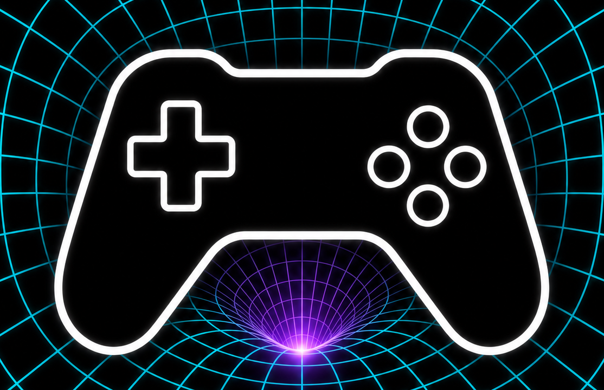

# AIGen Game



**The AI-powered agentic game dev framework.**

**Harnessing the AI-Eigen space for precise and instant game generation.**

AIGen Game is an ecosystem for AI-powered game development. It brings together an agentic game-dev framework, a reusable agent workflow orchestrator, and engine-facing automation so game ideas can move from intent to playable systems with speed and control.

The core idea is simple: game creation is a structured generative space. Mechanics, assets, rules, player experience, production phases, and engine operations are not isolated tasks. They are coordinates in an AI-Eigen space that agents can navigate, transform, and refine.

AIGen Game exists to make that space usable.

## What It Is

AIGen Game is not only a prompt-to-game tool. It is an entry point into a small family of projects for **agentic game creation**.

The projects have distinct roles:

1. **godot-agent** is an independent tool for driving the Godot engine through CLI and MCP.
2. **cli-agentic-workflow** is an independent tool for orchestrating AI agent workflows.
3. **meta-game** is the agentic game-dev framework that integrates both tools with professional game-making skills, asset pipelines, and phase-driven production.

Together, they turn AI generation into a directed development process rather than a one-shot output.

## Projects

| Project | Role in AIGen Game | Description |
| --- | --- | --- |
| [aigengame/meta-game](https://github.com/aigengame/meta-game) | Integrated agentic game-dev framework | An agentic 2D game maker that provides professional game-dev skills, asset-processing pipelines, reusable workflows, phase-driven lifecycle management, and human-in-the-loop feedback. It integrates `cli-agentic-workflow` and `godot-agent` as part of the production flow. |
| [aigengame/cli-agentic-workflow](https://github.com/aigengame/cli-agentic-workflow) | Independent workflow orchestration tool | A lightweight local-first CLI that orchestrates AI agent CLIs such as Claude and Codex into inspectable workflows defined with simple YAML. |
| [aigengame/godot-agent](https://github.com/aigengame/godot-agent) | Independent Godot automation tool | An agent-first CLI and MCP server that lets AI agents drive the Godot engine with structured output built for programmatic consumption. |

## How The Pieces Fit

**godot-agent** is the engine bridge. It lets agents operate Godot through CLI and MCP, with structured output that workflows can consume reliably. It can be used on its own wherever agent-controlled Godot automation is useful.

**cli-agentic-workflow** is the orchestration bridge. It turns agent work into repeatable runs: plan the graph, validate it, execute it, resume it, and report what happened. It can be used independently for any local-first agent workflow.

**Meta Game** is the integrated game-dev framework. It provides the game-making method: professional skills, asset-processing pipelines, reusable workflows, phase-driven lifecycle management, and human-in-the-loop feedback. It can use `cli-agentic-workflow` to coordinate agents and `godot-agent` to execute work inside Godot.

In short:

```text
Intent -> Meta Game -> Skills + Asset Pipelines + Phase Management
       -> cli-agentic-workflow -> Agentic Workflow Runs
       -> godot-agent -> Godot Engine
       -> Playable Game
```

## Core Concepts

### AI-Eigen Space

AIGen Game uses the idea of an AI-Eigen space as a product metaphor for controlled generation. Instead of asking AI for random game output, the framework aims to guide generation along meaningful game-development dimensions: genre, mechanics, style, pacing, constraints, tools, and production state.

Precision comes from controlling the space.

### AI Agents

Agents are focused collaborators. They can reason about design, implementation, assets, testing, review, documentation, or production flow. AIGen Game treats agents as participants in a workflow, not as isolated chat responses.

### Agentic Workflow

Agentic workflows give structure to AI work. They define what should happen, when it should happen, which agent or tool should handle it, and where human approval belongs.

This is how AIGen Game keeps generation fast without making it random or opaque.

### Skills

Skills capture reusable game-dev knowledge: design patterns, art direction, asset processing, engineering practices, QA habits, playtest loops, and production rituals.

They help agents work with consistency and craft across repeated projects.

### MCP

MCP connects agents to real tools and environments. In AIGen Game, MCP is part of the bridge between agentic reasoning and concrete game-making actions, especially when agents need to inspect, control, or automate external systems.

## Product Direction

AIGen Game is designed for creators and developers who want AI to become part of the game development process itself.

The framework should feel:

- **Fast**, but guided.
- **Generative**, but inspectable.
- **Automated**, but human-directed.
- **Technical**, but product-oriented.
- **Agentic**, but grounded in real game-dev workflows.

## Brand Direction

The visual direction centers on a game controller generated through a matrix warp.

The controller represents game creation. The matrix represents AI-Eigen space. The warp represents instant generation from structured possibility into playable form.

**AIGen Game: Harnessing the AI-Eigen space for precise and instant game generation.**
