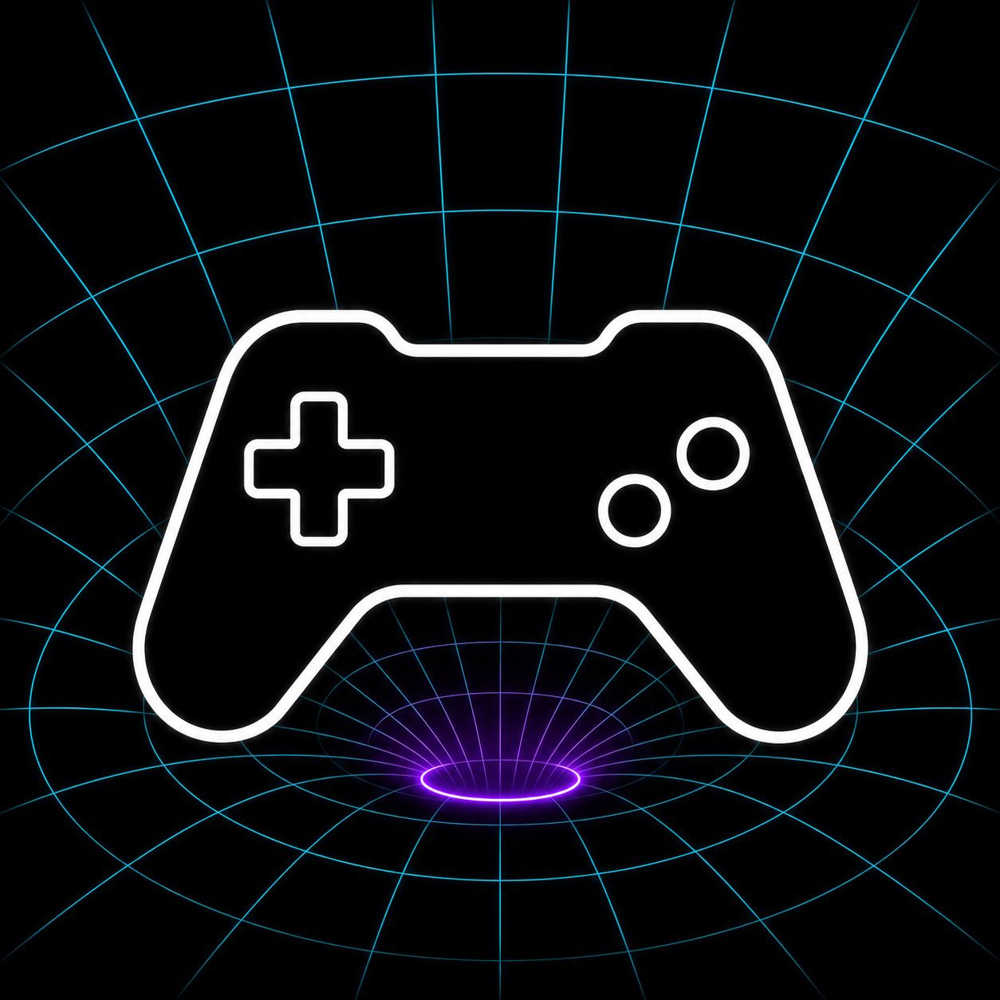

# AIGen Game

**The AI-powered game dev framework.**

**Harnessing the AI-Eigen space for precise and instant game generation.**

AIGen Game is a framework for turning game ideas into playable systems through AI-native development workflows. It treats game creation as a structured generative space: mechanics, assets, rules, tools, scenes, feedback loops, and production intent become coordinates that AI agents can explore, refine, and transform into working game experiences.

The goal is not just to generate a one-off prototype. AIGen Game is designed around repeatable game development: describing intent, decomposing work, applying specialized skills, coordinating agents, connecting tools, and iterating toward a precise result.

## Why AIGen Game

Modern game creation is no longer only about writing code faster. It is about orchestrating the full creative and technical loop: design, implementation, assets, testing, balancing, documentation, and iteration.

AIGen Game brings these steps into one AI-powered framework. It helps creators and teams move from concept to playable output with more speed, more control, and less friction.

## Core Ideas

### AI-Eigen Space

AIGen connects AI generation with the idea of an eigen space: a structured space of meaningful directions. Instead of treating generation as random output, AIGen Game aims to guide generation along the important dimensions of a game: genre, mechanics, pacing, world rules, style, constraints, and player experience.

This is the brand idea behind the slogan: precise and instant generation comes from controlling the space, not just prompting the model.

### AI Agents

AI agents act as focused collaborators inside the framework. Different agents can reason about design, implementation, assets, testing, refactoring, or production flow. Each agent has a role, a context, and a goal.

The framework is built for coordinated work, not isolated responses.

### Agentic Workflow

AIGen Game uses agentic workflows to move game development forward step by step. A high-level loop looks like this:

1. Define the game intent.
2. Break the intent into actionable work.
3. Route work to the right agents and skills.
4. Generate, inspect, and refine outputs.
5. Feed results back into the next iteration.

This creates a development process where AI can participate in planning, building, reviewing, and improving the game.

### Skills

Skills are reusable capabilities that make agents better at specific kinds of work. A skill might help with level design, gameplay mechanics, pixel art direction, playtesting, documentation, or engine-specific workflows.

Skills give the framework memory, consistency, and craft. They turn repeated patterns into stronger building blocks.

### MCP

MCP connects agents to tools, services, files, engines, editors, and external systems. For AIGen Game, this means AI workflows can become part of a real development environment instead of staying inside a chat window.

The result is a framework that can reason, act, inspect, and iterate across the game development stack.

## Product Experience

AIGen Game is designed to feel like a creative control surface for AI-powered game development.

You describe what you want to build. The framework maps that intent into a structured workflow. Agents and skills help generate the pieces. Connected tools make the work concrete. The system keeps the process iterative, inspectable, and directed.

The experience should feel fast, but not careless. Generative, but not random. Automated, but still guided by the creator.

## Brand Direction

The visual direction centers on a game controller generated through a matrix warp. The controller represents game creation. The matrix represents AI-Eigen space. The warp represents instant generation from structured possibility into playable form.

This keeps the brand simple and recognizable while still carrying the technical idea behind AIGen Game.

## Positioning

AIGen Game is for creators, developers, and teams who want AI to become part of the game development process itself.

It is not only a prompt-to-game tool. It is a framework for agentic game creation.

**AIGen Game: Harnessing the AI-Eigen space for precise and instant game generation.**
